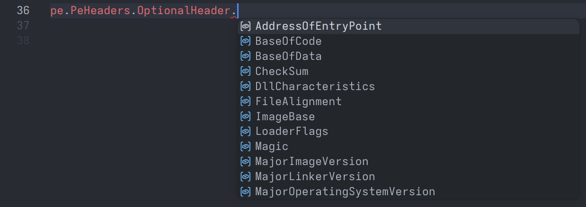
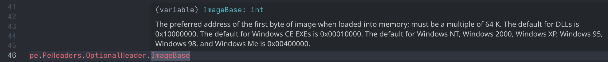

# `pefileplus` &mdash; typed wrapper for `pefile`

The reliability and robustness of `pefile` + proper typing and actually helpful docstrings = `pefileplus`.

## Installation

The package is published on [PyPI](https://pypi.org/project/pefileplus/). This means it can be installed through standard Python package managers, e.g.:

```sh
pip install pefileplus

poetry add pefileplus

uv add pefileplus
```

## Why does this exist?

While `pefile` has a great implementation for PE file parsing that has been tested with various malware samples and other software exploiting edge cases of the PE specification, its usability design is struggling to keep up with a modern Python development ecosystem, where we expect quasi-static typing, proper documentation, information about exceptions, etc., to be provided over a language server and accessible directly in our IDE.

In particular, you may find this library useful, if you don't want to learn all header field names by heart:



Or, if you want documentation accessible through a simple mouse hover:



Or, if you want any of the following:

- proper typing,
- unambiguous descriptions for function arguments and behaviour, e.g. for `.get_data()` methods,
- various enumeration types, such as `Characteristics` fields in the file header, optional header, or section headers, being represented with a proper enum class.

For constants and header fields, the docstrings directly copy the [public specification from Microsoft](https://learn.microsoft.com/en-us/windows/win32/debug/pe-format). Parsed fields/structures and methods are documented to reflect their meaning and behaviour as unambiguously as possible. Where you observe this to be suboptimal, please open an issue or submit a PR.

## Abstractions

When you import `pefileplus` and create an instance of `pefileplus.PE`, several high-level data structures
are populated based on the `pefile` attributes parsed from the binary.

### File headers

```python
from pefileplus import PE, PEFormatError, PESectionCharacteristics

try:
    pe = PE(path = "example.exe")
except PEFormatError as e:
    print(f"Not a valid PE file: {e}.")
    raise SystemExit(1)

print(f"Offset of PE header: {pe.PeHeaders.MzHeader.e_lfanew = :#x}")
print(f"Target architecture: {pe.PeHeaders.FileHeader.Machine.name = } ({pe.PeHeaders.FileHeader.Machine:#x})")
print(f"Image base address:  {pe.PeHeaders.OptionalHeader.ImageBase = :#x}")
```

Example output:

```
Offset of PE header: pe.PeHeaders.MzHeader.e_lfanew = 0x78
Target architecture: pe.PeHeaders.FileHeader.Machine.name = 'IMAGE_FILE_MACHINE_AMD64' (0x8664)
Image base address:  pe.PeHeaders.OptionalHeader.ImageBase = 0x21af1f60000
```

### Sections

```python
from pefileplus import PE, PEFormatError, PESectionCharacteristics

try:
    pe = PE(path = "example.exe")
except PEFormatError as e:
    print(f"Not a valid PE file: {e}.")
    raise SystemExit(1)

print(f"Number of sections: {len(pe.PeHeaders.Sections) = }")
print(f"Equivalent to this: {pe.PeHeaders.FileHeader.NumberOfSections = }")
print()

text = pe.get_section_by_name(".text")
if text is None:
    print("No .text section found in binary.")
else:
    print(".text section:")
    print(f"\t{text.Characteristics.name = !s} ({text.Characteristics:#x})")
    print(f"\t{text.has_characteristics(PESectionCharacteristics.IMAGE_SCN_MEM_EXECUTE) = }")
    print(f"\t{text.VirtualAddress = :#x}, {text.VirtualSize = :#x}, {text.PointerToRawData = :#x}, {text.SizeOfRawData = :#x}, ")
    print(f"\t{text.get_data(start = None, length = 16).hex(' ') = !s}")
    print(f"\t{text.get_entropy() = :.03f}")
```

Example output:

```
Number of sections: len(pe.PeHeaders.Sections) = 4
Equivalent to this: pe.PeHeaders.FileHeader.NumberOfSections = 4

.text section:
        text.Characteristics.name = IMAGE_SCN_CNT_CODE|IMAGE_SCN_MEM_EXECUTE|IMAGE_SCN_MEM_READ (0x60000020)
        text.has_characteristics(PESectionCharacteristics.IMAGE_SCN_MEM_EXECUTE) = True
        text.VirtualAddress = 0x1000, text.VirtualSize = 0x30000, text.PointerToRawData = 0x400, text.SizeOfRawData = 0x2f200, 
        text.get_data(start = None, length = 16).hex(' ') = 56 57 48 83 ec 28 48 89 ce 48 8b 09 48 85 c9 74
        text.get_entropy() = 6.276
```

### Imports and exports

```python
from pefileplus import PE, PEFormatError

try:
    pe = PE(path = "example.exe")
except PEFormatError as e:
    print(f"Not a valid PE file: {e}.")
    raise SystemExit(1)

print(f"Number of imports: {len(pe.Imports) = }")
if len(pe.Imports) > 0:
    print(f"First import entry: {pe.Imports[0].DllName = }, {pe.Imports[0].Symbol = }")
    print()

print(f"Number of exports: {len(pe.Exports) = }")
```

Example output:

```
Number of imports: len(pe.Imports) = 36
First import entry: pe.Imports[0].DllName = 'KERNEL32.dll', pe.Imports[0].Symbol = 'ExitProcess'

Number of exports: len(pe.Exports) = 0
```

> [!IMPORTANT]
> When a `PE` object is instantiated with `fast_load = True`, the `Imports` and `Exports` will always be empty; no exception will be raised when trying to access them.

## Limitations

- Currently as of version `2026.4.15`, data directories (except the import and export directory) are not handled by the wrapper. It is still possible to work with those using the raw `pefile` representation by accessing `PE.raw_pefile()`.

- The wrapper is only intended for **reading** PE files, not patching them. Overwriting or modifying the parsed structures will have no effect and typically does not make sense.
